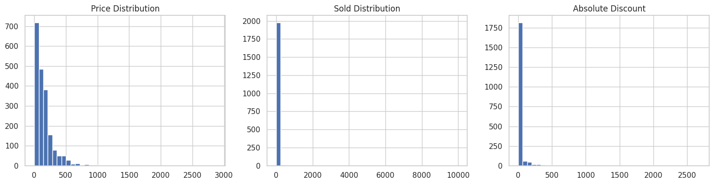
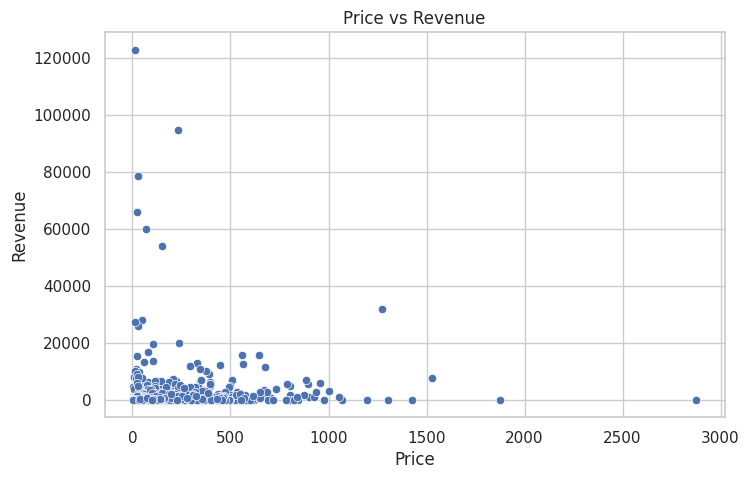

# Portfolio

---

## Python Picks
### 1. [🚀 E‑Commerce Furniture Analytics 2024](https://github.com/swapniltayde09/ecommerce-furniture-analytics-2024)
 

#### [Furniture Analytics Report (PDF)](pdf/Furniture%20Analytics%20Insights.pdf)

---
### [Project 2 Title](/pdf/sample_presentation.pdf)

---
### [Project 3 Title](http://example.com/)

---

## SQL Picks
### [Instagram Influencer Analytics Dashboard](https://github.com/swapniltayde09/Instagram-Influencer-Analytics)
  
#### [Instagram Influencers Analytics Report (PDF)](pdf/Instagram_Influencer_Report_Final.pdf)

---
### [Project 2 Title](http://example.com/)
 

---
### [Project 3 Title](http://example.com/)
 

---

## Microsoft Excel Picks
### [Project 1 Title](http://example.com/)
### [Project 2 Title](http://example.com/)
### [Project 3 Title](http://example.com/)
<!-- - [Project 4 Title](http://example.com/) -->
<!-- - [Project 5 Title](http://example.com/) -->

---

Page template forked from <a href="https://github.com/evanca/quick-portfolio">evanca</a>

<!-- Remove above link if you don't want to attibute -->
