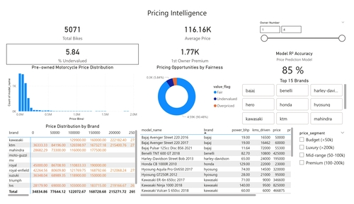
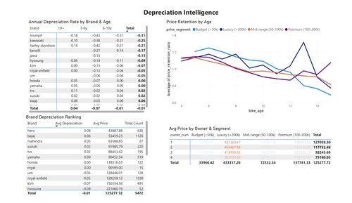
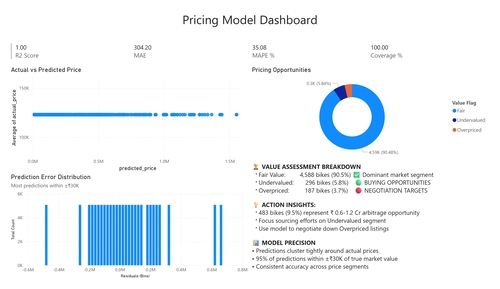

# Portfolio

---

## Python Picks

### 1. [IBM HR Analytics Employee Attrition & Performance](https://github.com/swapniltayde09/hr-attrition-analysis-ml-dashboard)

 

#### [IBM HR Analytics Employee Attrition & Performance Report (PDF)](pdf/HR_Attrition_Analysis_Report_Detailed.pdf)

---

### 2. [Data Science Job Salaries](https://github.com/swapniltayde09/Data-Science-Job-Salaries-Analysis)

 

##### [Data Science Job Salaries Analytics Report (PDF)](pdf/Data_Science_Salary_EDA_Detailed_Report.pdf)

---

### 3. [Used Bike Prices - Feature Engineering and EDA](https://github.com/swapniltayde09/pre-owned-motorcycle-analytics)

##### [Pre-owned Motorcycles Financial Analysis Report (PDF)](pdf/Pre-Owned_Motorcycle_Financial_Analysis_Report.pdf)

---

## SQL Picks

### 1. [Instagram Influencer Analytics Dashboard](https://github.com/swapniltayde09/Instagram-Influencer-Analytics)

 

##### [Instagram Influencers Analytics Report (PDF)](pdf/Instagram_Influencer_Report_Final.pdf)

---

### 2. [Finance & Accounting Courses - Udemy (13K course)](https://github.com/swapniltayde09/Udemy-Courses-Performance-Analysis)

 

##### [Udemy Courses Analytics Report (PDF)](pdf/Udemy_EDA_Presentation.pdf)

---

### 3. [Supermart Grocery Sales Retail Analytics](https://github.com/swapniltayde09/Supermart-Grocery-Sales-Retail-Analytics)

 

##### [Supermart Sales Analytics Report(PDF)](pdf/Supermart_Sales_Analytics_Report.pdf) 

---

## Microsoft Excel Picks

### [Netflix Content Strategy Analysis](https://github.com/swapniltayde09/Netflix-Content-Strategy-Analysis)

##### [Supermart Sales Analytics Report(PDF)](pdf/Supermart_Sales_Analytics_Report.pdf) 

---
### [Project 2 Title](http://example.com/)

 

##### [Supermart Sales Analytics Report(PDF)](pdf/Supermart_Sales_Analytics_Report.pdf) 

---

### [Project 3 Title](http://example.com/)

 

##### [Supermart Sales Analytics Report(PDF)](pdf/Supermart_Sales_Analytics_Report.pdf) 

---
<!-- - [Project 4 Title](http://example.com/) -->
<!-- - [Project 5 Title](http://example.com/) -->

---

Page template forked from <a href="https://github.com/evanca/quick-portfolio">evanca</a>

<!-- Remove above link if you don't want to attibute -->
