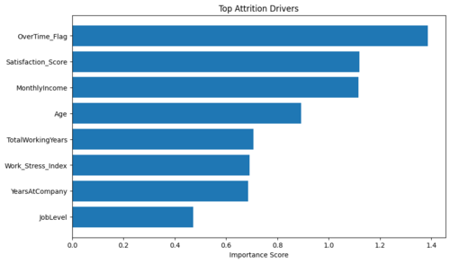
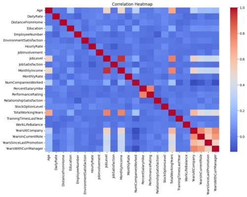
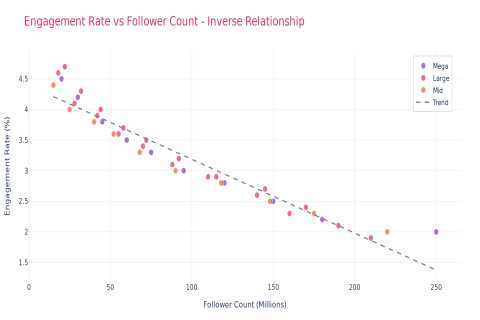
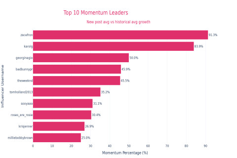
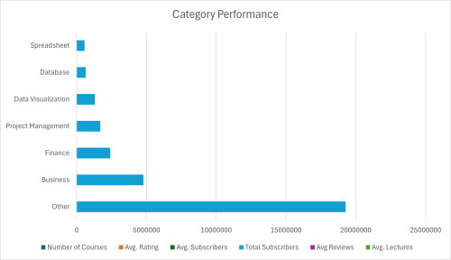
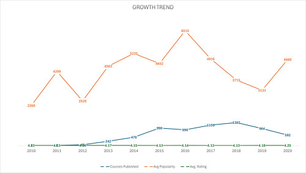
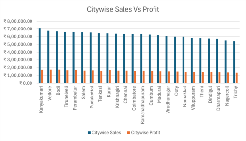
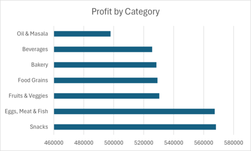

# Portfolio

---

## Python Picks

### 1. [IBM HR Analytics Employee Attrition & Performance](https://github.com/swapniltayde09/hr-attrition-analysis-ml-dashboard)

 

#### [IBM HR Analytics Employee Attrition & Performance Report (PDF)](pdf/HR_Attrition_Analysis_Report_Detailed.pdf)

---

### [Data Science Job Salaries](https://github.com/swapniltayde09/Data-Science-Job-Salaries-Analysis)

  

#### [Data Science Job Salaries Analytics Report (PDF)](pdf/Data_Science_Salary_EDA_Detailed_Report.pdf)

---

### [Project 3 Title](http://example.com/)

#### [Data Science Job Salaries Analytics Report (PDF)](pdf/Data_Science_Salary_EDA_Detailed_Report.pdf)

---

## SQL Picks

### [Instagram Influencer Analytics Dashboard](https://github.com/swapniltayde09/Instagram-Influencer-Analytics)

  

#### [Instagram Influencers Analytics Report (PDF)](pdf/Instagram_Influencer_Report_Final.pdf)

---

### [Finance & Accounting Courses - Udemy (13K course)](https://github.com/swapniltayde09/Udemy-Courses-Performance-Analysis)
 
#### [Udemy Courses Analytics Report (PDF)](pdf/Udemy_EDA_Presentation.pdf)

---

### [Supermart Grocery Sales Retail Analytics](https://github.com/swapniltayde09/Supermart-Grocery-Sales-Retail-Analytics)

 

#### [Supermart Sales Analytics Report(PDF)](pdf/Supermart_Sales_Analytics_Report.pdf) 

---

## Microsoft Excel Picks
### [Project 1 Title](http://example.com/)
### [Project 2 Title](http://example.com/)
### [Project 3 Title](http://example.com/)
<!-- - [Project 4 Title](http://example.com/) -->
<!-- - [Project 5 Title](http://example.com/) -->

---

Page template forked from <a href="https://github.com/evanca/quick-portfolio">evanca</a>

<!-- Remove above link if you don't want to attibute -->
